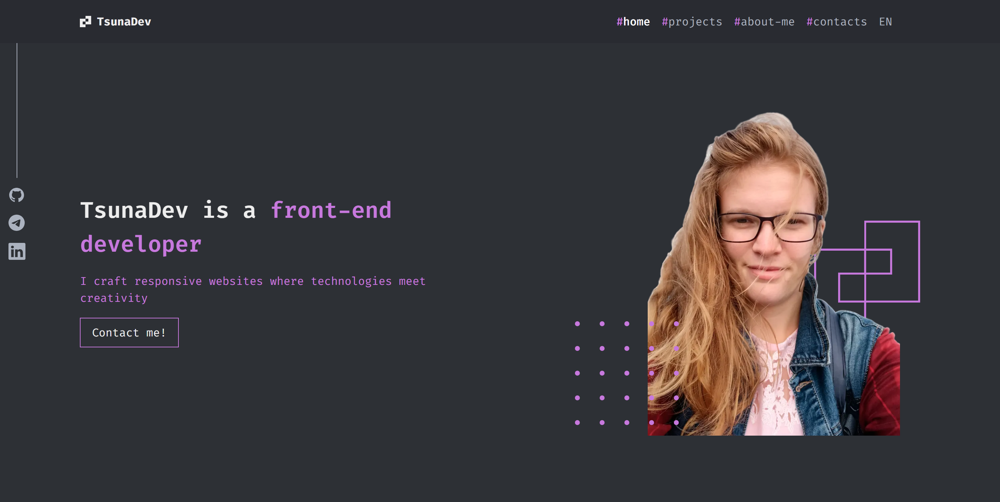

# Portfolio

A multilingual portfolio website built with Next.js and TypeScript.

## Preview



## Technologies

- **Next.js**
- **TypeScript**
- **SCSS**
- **i18n**

## Architecture

```
src/
├── app/                    # Global application settings and routes
│   ├── [locale]/           # Localized pages
│   ├── about/              # "About Me" page
│   ├── contacts/           # "Contacts" page
│   └── projects/           # "Projects" page
│
├── constants/              # Project constants
├── features/               # Business features
│   └── BurgerMenu/         # Navigation menu
│
├── i18n/                   # Localization configuration and files
│   ├── language/           # JSON translation files
│   ├── config.ts           # i18n configuration
│   └── navigation.ts       # Localized routes
│
├── shared/                 # Reusable code
│   ├── Button/             # Button UI component
│   ├── Media/              # Media component
│   ├── Section/            # Page sections
│   ├── SkillBox/           # Skill blocks
│   └── Title/              # Titles
│
└── widget/                 # Independent widgets
    ├── AboutMe/            # "About Me" widget
    ├── Contacts/           # "Contacts" widget
    ├── Footer/             # Website footer
    └── Header/             # Website header
```

## Development

```bash
# Install dependencies
yarn install

# Start development server
yarn dev

# Build the project
yarn build

# Run linter
yarn lint
```
